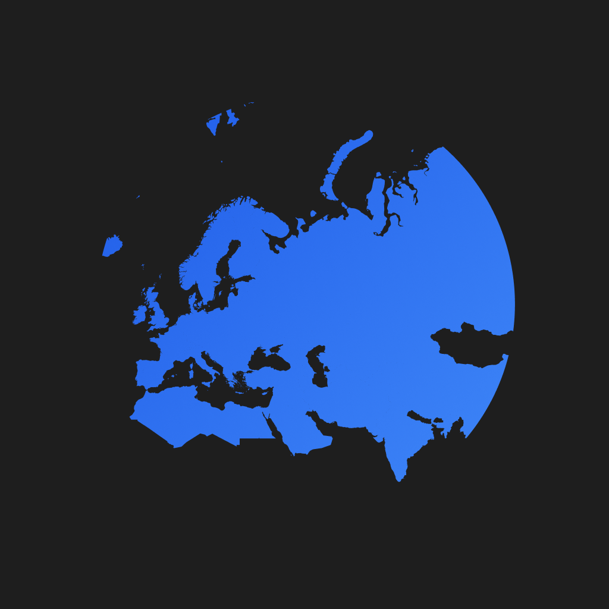

# Wayfar
<div align="center">

[](https://github.com/Lorenzo0111/Wayfar/releases/latest)
[](LICENSE)
[](https://discord.gg/HT47UQXBqG)

</div>

Wayfar is an application designed to help you explore travel regions. You can track your visits, view them on a world map, and monitor travel statistics.



## Features

- **Explore Regions**: Browse and search regions and countries
- **Track your visits**: Record your visits to countries and regions
- **Global Map**: View your visited countries on a world map
- **Travel Statistics**: Monitor statistics such as the number of countries and regions visited

## Installation

1. Clone the repository
2. Install the dependencies with `yarn install`
3. Start the development server with `yarn dev`

## Build and Deploy

Wayfar uses EAS (Expo Application Services) for build and update management. You can build the application for iOS and Android using the following commands:

```
eas build --platform ios
eas build --platform android
```

## License

Wayfar is distributed under the MIT license. See the [LICENSE](./LICENSE) file for more details.

## Credits

The country data is adapted from [stefanbinder/countries-states](https://github.com/stefanbinder/countries-states) under the MIT license.
